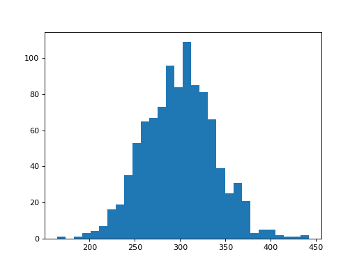

# Summary

A central goal of statistics is to understand and to quantify uncertainty. For a few specific statistics, like the sample mean, there are formulas for estimating this uncertainty. For a general statistic though, no such formula exists.

The fundamental difficulty is that "uncertainty'' describes what would happen if we were to observe repeated samples from the population, but typically we only have a single sample. The bootstrap (Efron 1979, Efron and Tibshirani 1993) is a simulation-based technique that circumvents this issue  by treating it as if it were the population and repeatedly sampling from it. The statistic can be re-calculated for each of these pseudo-samples, from which we can extract a measure of uncertainty from.  The beauty of the bootstrap is that it is a simple algorithm that works for almost any statistic.

``resample`` is a Python package that creates a convenient framework for performing the bootstrap. This package allows the user to easily specify a variety of different bootstraps, thus serving as a counterpart to the popular ``boot`` library in R.  The main features of ``resample`` include:

- bootstrap confidence intervals (including options to use Efron, Percentile, BCa)
- standard errors, point estimates, and bias
- plots of bootstrap distributions
- user defined estimators with checks that the bootstrap is valid
- integration with the ``pandas`` and ``numpy`` libraries
- specification of more complex bootstraps

# Example

resample allows the user to define and run a bootstrap in one line. As an example, we will bootstrap the variance of the "mec" column from the student scores data set (Efron and Tibshirani 1993):

```python
bootstrap = rs.boot(data["mec"], np.var)
```

This creates a ``Results`` object, which stores the original and bootstrapped statistics, in addition to having methods to calculate various estimates, plot the bootstrap distribution, etc. For example, a plot of the simulation can be obtained as follows:

```python
bootstrap.plot()
```


``resample`` accommodates different confidence interval methods:

```python
bootstrap.ci() #efron interval by default
bootstrap.ci(kind="loc_percentile")
bootstrap.ci(kind="BCa")
```

Full documentation with a tutorial can be accessed at <https://cenonn.github.io/resample/>.

# References
